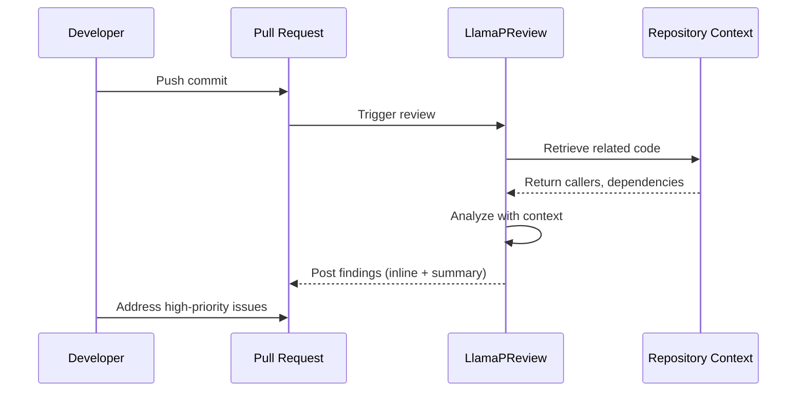

# LlamaPReview

<div align="center">

[](https://github.com/apps/llamapreview)
[](https://jetxu-llm.github.io/LlamaPReview-site/)
[](https://github.com/marketplace/llamapreview)
[](https://github.com/marketplace/llamapreview)

**Evidence-Based AI Code Review for Maintainers**

*1-Click install • Zero config • Context retrieval + severity gating deliver low-noise, high-impact PR insights you can trust.*

[Install Now](https://github.com/marketplace/llamapreview) • [Documentation](https://jetxu-llm.github.io/LlamaPReview-site/) • [Community](https://github.com/JetXu-LLM/LlamaPReview-site/discussions)

</div>

---

## 🎯 The Problem

Most AI code review tools **see only the diff**—they miss critical bugs that ripple through unchanged code. The result? High noise, low signal, and review fatigue.

**LlamaPReview takes a different approach**: We analyze the **entire repository as context**, understanding how changes propagate through your system to catch cross-file bugs that other tools miss.

### Real-World Impact

In a [20K-star open source project](https://jetxu-llm.github.io/LlamaPReview-site/2024/10/20/beyond-the-diff.html), LlamaPReview caught a **critical transaction commit failure** invisible in the diff—a bug that would have caused silent data loss in production.

---

## ✨ Key Features

### 🔍 Context Retrieval Engine
Goes beyond the diff to find **related, unchanged code** that could be affected by your changes. Surfaces ripple effects early.

### 📊 Evidence-Backed Findings
Every high-priority issue ties to **real code snippets** with confidence scores. No vague suggestions—just actionable insights.

### 🎚️ Severity Gating & Low-Noise Prioritization
Deterministic classification system reduces false positives by **60%** compared to competitors ([see analysis](https://jetxu-llm.github.io/LlamaPReview-site/2024/10/31/low-noise-matters.html)).

### 🔗 Native GitHub Experience
- **Inline comments** on specific code lines
- **Structured summary tables** with severity classification
- **Mermaid diagrams** (Advanced edition) for architectural impact visualization

---

## 🚀 Quick Start

### Installation (30 seconds)

1. **Install the GitHub App**: [github.com/marketplace/llamapreview](https://github.com/marketplace/llamapreview)
2. **Select repositories**: Choose public or private repos
3. **Done!** LlamaPReview will automatically review new PRs

No configuration files. No setup. Just install and go.

### Example Review



**What you get:**
- ✅ Inline comments on critical issues
- ✅ Summary table with severity classification
- ✅ Architecture diagrams (Advanced edition)
- ✅ Suggested fixes with code snippets

---

## 📦 Editions

### Community (Free Forever)
Perfect for open source and small teams.

- ✅ Unlimited AI-powered PR reviews
- ✅ All major programming languages
- ✅ Evidence-backed findings
- ✅ Rich-text reviews with collapsible sections
- ✅ GitHub workflow integration

[**Get Started Free →**](https://github.com/marketplace/llamapreview)

### Advanced (Free for Public Repos)
Deep-context analysis for complex PRs.

- ✅ **Everything in Community**
- ✅ **Core deep-context analysis** with deeper dependency reasoning
- ✅ **Automatic Mermaid diagrams** for architectural impacts
- ✅ **Inline code suggestions** tuned by contextual evidence
- ✅ Triggered automatically for complex PRs

**Free 3-PR trial** for new private repos with Community subscription.

[**Get Started Free →**](https://github.com/marketplace/llamapreview)

### Professional (Coming Soon - 20% OFF First 100)
Enterprise-grade intelligence with zero-knowledge security.

- ✅ **Everything in Advanced**
- ✅ **Secure Code-Knowledge Graph**: Classes, methods, dependencies, call graphs
- ✅ **Zero-Knowledge Code Storage**: Cryptographic fingerprints only (HMAC-SHA256)
- ✅ **Self-adaptive review style** learned from your team
- ✅ **Customizable review rules** and prompts
- ✅ Advanced AI engines (Gemini 2.5, GPT-5)
- ✅ PR statistics dashboard
- ✅ Priority support

[**Join Waitlist & Save 20% →**](https://tally.so/r/n0Nxx9)

---

## 🏗️ Architecture & Technical Vision

### Current Implementation

LlamaPReview uses a **context retrieval engine** powered by:
- **GitHub Search API** for finding related code
- **Semantic similarity matching** to identify affected callers
- **Deterministic severity gating** to reduce noise
- **Multi-model ensemble** (Claude, GPT-4, Gemini) for robust analysis

### Future: Code-Knowledge Graph (Professional Edition)

We're building the next generation of code intelligence:

```
┌─────────────────────────────────────────────────┐
│          Code-Knowledge Graph (In Dev)          │
├─────────────────────────────────────────────────┤
│  • Classes, methods, dependencies, call graphs  │
│  • Zero-knowledge cryptographic storage         │
│  • HMAC-SHA256 blind indexing                   │
│  • Repo-scoped salts (mathematically private)   │
└─────────────────────────────────────────────────┘
                      ↓
        ┌─────────────────────────────┐
        │   Graph RAG Architecture    │
        │  (Retrieval-Augmented Gen)  │
        └─────────────────────────────┘
                      ↓
        • Cross-repo analysis capability
        • Dynamic behavior understanding
        • 70%+ improvement in context quality
```

**Why Graph RAG?**
- Traditional RAG retrieves text chunks; **Graph RAG retrieves structured relationships**
- Understands code as a **semantic graph**, not just text
- Enables **cross-file reasoning** without exposing code content

**Privacy-First Design:**
- Code content is **never stored**—only cryptographic hashes
- Blind indexing makes it **mathematically impossible** to reverse-engineer code
- From "we promise not to look" to "we mathematically cannot look"

[Read the technical deep-dive →](https://jetxu-llm.github.io/LlamaPReview-site/)

---

## 📊 Validation & Trust

### Community Adoption
- **4,000+** active repositories
- **35,000+** combined repository stars
- Trusted by projects from indie libraries to large-scale systems

### Proven Results
- **61% signal ratio** vs. 21% for competitors ([case study](https://jetxu-llm.github.io/LlamaPReview-site/2024/10/31/low-noise-matters.html))
- **Caught critical bugs** invisible in diff-only analysis ([Vanna.ai case](https://jetxu-llm.github.io/LlamaPReview-site/2024/10/20/beyond-the-diff.html))
- **60% reduction** in false positive rate

### Open Development
- [GitHub Discussions](https://github.com/JetXu-LLM/LlamaPReview-site/discussions) for community feedback
- [Public blog](https://jetxu-llm.github.io/LlamaPReview-site/) with technical deep-dives
- Transparent about limitations and future roadmap

---

## 🛡️ Privacy & Security

### Current (Community & Advanced)
- ✅ **No code storage**: PRs processed in-memory only
- ✅ **GitHub-native security**: OAuth 2.0, minimal permissions
- ✅ **Transparent operations**: Clear data handling policies

### Future (Professional)
- 🔐 **Zero-knowledge architecture**: Cryptographic guarantees
- 🔐 **Blind indexing**: HMAC-SHA256 with repo-scoped salts
- 🔐 **Mathematically private**: Irreversible code fingerprints

---

## 🤝 Contributing & Community

We welcome feedback, bug reports, and feature requests!

- **Discussions**: [github.com/JetXu-LLM/LlamaPReview-site/discussions](https://github.com/JetXu-LLM/LlamaPReview-site/discussions)
- **Issues**: Report bugs or request features
- **Blog**: Technical articles and case studies at [jetxu-llm.github.io/LlamaPReview-site](https://jetxu-llm.github.io/LlamaPReview-site/)

---

## 📚 Resources

- **Documentation**: [Full docs](https://jetxu-llm.github.io/LlamaPReview-site/)
- **Case Studies**: 
  - [Beyond the Diff: Catching Critical Bugs](https://jetxu-llm.github.io/LlamaPReview-site/2024/10/20/beyond-the-diff.html)
  - [Why Low Noise Matters](https://jetxu-llm.github.io/LlamaPReview-site/2024/10/31/low-noise-matters.html)
- **Related Projects**: [llama-github](https://github.com/JetXu-LLM/llama-github) (open-source library)

---

## 🎓 About the Author

Built by [Jet Xu](https://jetxu-llm.github.io/), an enterprise architect with 15+ years of experience in AI-powered platforms and mission-critical infrastructure. Passionate about **Code Intelligence & Repository Graph RAG**—building systems where AI agents truly understand software through structured knowledge graphs.

Connect: [LinkedIn](https://www.linkedin.com/in/jet-xu/) • [Blog](https://jetxu-llm.github.io/)

---

## 📄 License & Support

- **LlamaPReview**: Proprietary (free for public repos)
- **llama-github library**: Apache 2.0 (open source)

**Support**: [Customer Support](https://jetxu-llm.github.io/LlamaPReview-site/customer_support.html) • [Privacy Policy](https://jetxu-llm.github.io/LlamaPReview-site/privacy.html)

---

<div align="center">

**Ready to elevate your code reviews?**

[Install LlamaPReview](https://github.com/marketplace/llamapreview) • [Join Professional Waitlist](https://tally.so/r/n0Nxx9)

*Developed with ❤️ for the open source community*

</div>
